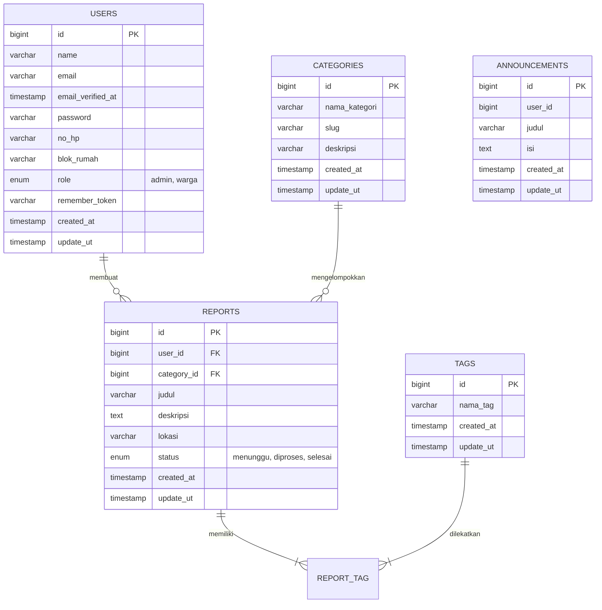

# ♻️ BiSa (Bersih Bersama)

[](https://laravel.com)
[](https://laragon.org)
[](https://tailwindcss.com)

**BiSa (Bersih Bersama)** adalah platform pelaporan digital berbasis web yang dirancang khusus untuk mendigitalisasi sistem manajemen keluhan sampah di lingkungan Rukun Tetangga (RT). Aplikasi ini menghubungkan warga secara langsung dengan pengurus komplek (Admin/Pak RT) secara *real-time* untuk menciptakan lingkungan sosial yang bersih dan responsif.

Proyek ini dikembangkan untuk memenuhi Tugas Akhir mata kuliah **Pemrograman Web II**

---
## 👥 Tim Pengembang (Contributors)

Proyek ini dirancang, dibangun, dan dikembangkan oleh:
* **Rabiah Riska Amaliah** — *Repository Owner & Database*
* **Amanda Arva Safaraya** — *Backend*
* **Muhammad Naufal Abdillah** — *Frontend*

---

## 🛠️ Spesifikasi Teknologi (Tech Stack)

Aplikasi ini menggunakan ekosistem teknologi modern berbasis PHP dan JavaScript untuk menjamin performa yang optimal:
* **Base Framework:** Laravel v12.6.1 (Backend MVC Framework)
* **Language Runtime:** PHP v8.2.12+
* **Database Engine:** MySQL v8.0 / MariaDB v10.4 
* **Frontend Build Tool:** Vite v6.x 
* **UI Styling Framework:** Tailwind CSS v4.x

---

## 🚀 Fitur Utama Sistem

1. **Digitalisasi Pengumuman Komplek:** Memungkinkan pengurus RT menyebarkan pengumuman kebersihan atau jadwal gotong royong warga.
2. **Sistem Pelacakan:** Warga dapat memantau secara berkala apakah laporan tumpukan sampah mereka sedang diproses atau sudah selesai ditangani.
3. **Multi-Role Authentication:** Memisahkan akses dan data secara jelas antara warga komplek dan pengurus/admin untuk menjaga privasi serta keamanan informasi.
4. **Formulir Keluhan Interaktif :** Fitur pelaporan sampah yang memungkinkan warga mengisi kategori sampah, tags, dan lokasi kejadian secara detail.

---

## 🔐 Hak Akses Pengguna (User Access Rights)

Sistem membagi hak akses ke dalam 3 tingkatan utama:

### 1. Hak Akses: Pengunjung Publik 
* Dapat mengakses halaman utama sistem (**Landing Page**).
* Dapat melakukan pendaftaran akun baru (**Register**).
* Dapat masuk ke dalam sistem (**Login**) menggunakan akun terdaftar.

### 2. Hak Akses: Warga Komplek 
Setelah sukses login, pengguna dengan peran Warga memiliki hak akses:
* **Dashboard Warga:** Melihat pengumuman, memantau ringkasan total laporan pribadi serta status perkembangannya.
* **Manajemen Profil Mandiri:** Melihat detail informasi akun dan memperbarui data profil lewat formulir edit.
* **Manajemen Keluhan :**
  * Melihat seluruh riwayat laporan sampah pribadi yang pernah dikirim.
  * Membuat dan mengirim laporan keluhan sampah baru ke sistem.
  * Melihat detail laporan.
  * Mengubah isi teks laporan selama belum dieksekusi oleh admin.
  * Menghapus laporan keluhan pribadi dari sistem .
* **Keamanan Akun:** Melakukan keluar dari sistem secara aman (**Logout**).

### 3. Hak Akses: Admin Komplek 
Pengguna dengan peran Admin (Pak RT ) bertindak sebagai pengambil keputusan tertinggi di dalam sistem:
* **Dashboard Admin:** Melihat total statistik grafik laporan warga.
* **Validasi Keluhan Masuk:**
  * Melihat daftar seluruh keluhan yang dikirimkan oleh seluruh warga.
  * Memeriksa detail deskripsi keluhan dan lokasi spesifik warga.
  * Memperbarui status penanganan sampah (*Menunggu ➡️ Diproses ➡️ Selesai*) lewat metode `PATCH`.
  * Menghapus laporan keluhan warga jika dinilai tidak valid.
* **Manajemen Pengumuman RT:**
  * Memantau arsip seluruh pengumuman komplek.
  * Membuat pengumuman atau instruksi kebersihan baru.
  * Mengubah teks isi pengumuman yang sudah diterbitkan.
  * Menghapus pengumuman lama dari papan informasi warga.
* **Manajemen Pengguna (Read-Only):**
  * Mengakses dan memantau daftar seluruh identitas akun warga yang aktif terdaftar di lingkungan komplek.
 
## 📊 Arsitektur & Atribut Basis Data


---

# 🛠️ Panduan Instalasi Lokal - Aplikasi BiSa (Bijak Sampah)

Panduan ini akan menuntun Anda untuk melakukan instalasi dan menjalankan aplikasi **BiSa** di lingkungan lokal komputer menggunakan **Laragon** sebagai local server.

---

## 📋 Prasyarat Sistem (Prerequisites)

Sebelum memulai, pastikan perangkat Anda sudah terinstal beberapa perangkat lunak berikut:
* **Laragon** (Versi Full direkomendasikan, sudah include PHP 8.2+ & MySQL)
* **Composer** (Untuk manajemen dependensi PHP/Laravel)
* **Node.js** (Versi LTS terbaru, untuk manajemen aset Vite/Tailwind)
* **Git** (Untuk kontrol versi kode)

---

## 🚀 Langkah-Langkah Instalasi

### Langkah 1: Kloning Repositori Proyek
Buka terminal Anda (Git Bash, PowerShell, atau Terminal VS Code), lalu jalankan perintah berikut untuk mengunduh source code dari GitHub:
```bash
git clone [https://github.com/maylia-15/ProjectAkhir-WebII.git](https://github.com/maylia-15/ProjectAkhir-WebII.git)
cd ProjectAkhir-WebII
```

---

### Langkah 2: Instalasi Dependensi Paket (Backend & Frontend)
Unduh seluruh pustaka kode yang dibutuhkan oleh Laravel dan Tailwind CSS dengan menjalankan dua perintah ini secara bergantian:

1. **Instal paket backend (PHP):**
```bash
   composer install
   ```
2. **Instal paket frontend (JavaScript & CSS):**
```bash
   npm install
   ```

---

### Langkah 3: Konfigurasi Environment File (`.env`)
Aplikasi memerlukan file `.env` sebagai pusat pengaturan sistem dan database lokal Anda.
1. Salin file template bawaan dengan perintah:
```bash
   cp .env.example .env
   ```
2. Buka file `.env` yang baru terbentuk di VS Code, lalu cari dan sesuaikan konfigurasi basis data Anda dengan setelan standar Laragon (tanpa password):
```env
   DB_CONNECTION=mysql
   DB_HOST=127.0.0.1
   DB_PORT=3306
   DB_DATABASE=db_BISA
   DB_USERNAME=root
   DB_PASSWORD=
   ```
3. Simpan perubahan file (`Ctrl + S`).

---

### Langkah 4: Setup Database & Generate Aplikasi
Pastikan aplikasi **Laragon** Anda sudah dalam posisi **Start All** (Apache dan MySQL menyala hijau), kemudian:

1. Jalankan perintah pembuatan kunci enkripsi aplikasi:
```bash
   php artisan key:generate
   ```
2. Jalankan perintah migrasi untuk membangun ulang seluruh tabel sekaligus menyuntikkan data contoh (*warga, admin, dan laporan dummy*):
```bash
   php artisan migrate:fresh --seed
   ```
   > 💡 *Tips: Jika muncul pertanyaan di terminal bahwa database `db_BISA` belum tersedia di Laragon Anda, cukup ketik **`yes`** lalu tekan **Enter**. Laravel akan otomatis membuatkannya untuk Anda.*

---

### Langkah 5: Menjalankan Aplikasi Lokal

Aplikasi ini membutuhkan dua mesin server yang berjalan secara bersamaan di latar belakang. Buka **dua jendela terminal terpisah** di VS Code Anda, lalu eksekusi:

* **Terminal Jendela 1 (Server Utama Laravel):**
```bash
  php artisan serve
  ```
  *Buka browser Anda dan akses alamat:* **`http://127.0.0.1:8000`**

* **Terminal Jendela 2 (Kompilator Tampilan Vite):**
```bash
  npm run dev
  ```
  *(Biarkan terminal ini tetap menyala agar seluruh aset visual, gaya Tailwind, dan JavaScript termuat dengan sempurna di browser).*

---

## 🔑 Akun Demo Pengujian (Seeder Accounts)

Setelah halaman website berhasil terbuka di browser, Anda dapat menguji fungsionalitas sistem pada menu **Login** menggunakan akun bawaan berikut:

| Hak Akses (Role) | Alamat Email | Kata Sandi (Password) |
| :--- | :--- | :--- |
| **Admin Komplek (Pak RT)** | `admin@bisa.com` | `password123` |
| **Warga Perumahan** | `warga@bisa.com` | `password123` |
